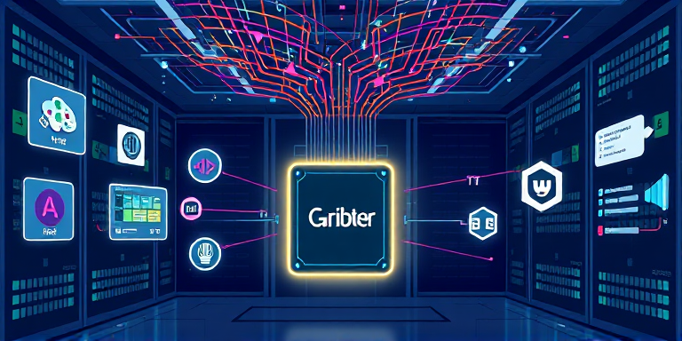

# Arbiter

Arbiter is your personal AI studio — a single server that runs a whole collection of AI models on your machine, so you can generate images, clone voices, transcribe audio, create talking-head videos, and more, all from one place.

Instead of juggling a dozen separate AI tools, you ask Arbiter to do things, and it figures out which model to use, when to load it, and how to get the job done — even if that means waiting while a previous task finishes. Think of it as a smart queue for your GPU.

---

## What can it do?

Arbiter supports 12 different types of AI jobs out of the box:

| What you want | Job type |
|---|---|
| Generate an image from a text description | `image-generate` |
| Transform an existing image with a text prompt | `image-edit` |
| Remove the background from a photo | `background-remove` |
| Describe what's in an image | `caption` |
| Ask a question about an image | `query` |
| Find and locate objects in an image | `detect` |
| Transcribe speech from an audio file | `transcribe` |
| Turn text into speech (built-in voices) | `tts-custom` |
| Turn text into speech in someone's voice | `tts-clone` |
| Turn text into speech in a voice you describe | `tts-design` |
| Make a portrait photo talk in sync with audio | `talking-head` |
| Generate a video from images and audio | `video-generate` |

---

## Getting started

### 1. Install

```bash
cd arbiter
python -m venv .venv
source .venv/bin/activate
pip install -e ".[dev]"
```

### 2. Configure

```bash
cp local/config.default.json local/config.json
```

You can leave the config as-is to start. Edit `local/config.json` later to tune memory limits or model settings.

### 3. Start the server

```bash
./run server
```

The server starts on `http://localhost:8400`. It'll run quietly in the background, loading models only when they're needed.

### 4. Check everything is working

```bash
./run health
```

You should see `{"status": "ok", ...}`. You're good to go!

---

## How to use it

Everything works as a job: you submit a request, get back a job ID, then ask for the result when it's ready. Here's the pattern in Python:

```python
import base64, time, requests

ARBITER = "http://localhost:8400"

def run_job(job_type, params):
    # Submit
    resp = requests.post(f"{ARBITER}/v1/jobs", json={"type": job_type, "params": params})
    job_id = resp.json()["job_id"]
    
    # Wait for result
    while True:
        status = requests.get(f"{ARBITER}/v1/jobs/{job_id}").json()
        if status["status"] == "completed":
            return status["result"]
        if status["status"] in ("failed", "cancelled"):
            raise Exception(status.get("error", "job ended"))
        time.sleep(1)
```

### Generate an image

```python
result = run_job("image-generate", {
    "prompt": "a red fox sitting in autumn leaves, watercolor style",
    "width": 1024,
    "height": 1024,
})

with open("fox.png", "wb") as f:
    f.write(base64.b64decode(result["data"]))
```

### Transcribe audio

```python
with open("recording.wav", "rb") as f:
    audio = base64.b64encode(f.read()).decode()

result = run_job("transcribe", {"audio": audio})
print(result["text"])
```

### Remove a background

```python
with open("photo.jpg", "rb") as f:
    image = base64.b64encode(f.read()).decode()

result = run_job("background-remove", {"image": image})

with open("photo-nobg.png", "wb") as f:
    f.write(base64.b64decode(result["data"]))
```

### Clone a voice

```python
with open("my_voice_sample.wav", "rb") as f:
    ref_audio = base64.b64encode(f.read()).decode()

result = run_job("tts-clone", {
    "text": "Hello! This message is spoken in my voice.",
    "ref_audio": ref_audio,
    "ref_text": "This is what was said in the reference recording.",
})

with open("cloned.wav", "wb") as f:
    f.write(base64.b64decode(result["data"]))
```

### Design a voice from a description

```python
result = run_job("tts-design", {
    "text": "Good morning, and welcome to the show.",
    "voice_description": "A warm, deep male voice with a British accent. Calm and authoritative.",
})
```

### Ask a question about an image

```python
with open("photo.jpg", "rb") as f:
    image = base64.b64encode(f.read()).decode()

result = run_job("query", {
    "image": image,
    "question": "How many people are in this photo?",
})
print(result["text"])  # "There are three people in the image."
```

---

## The command line

The `./run` script gives you quick access to common tasks:

```bash
./run server              # Start the server
./run ps                  # See what models are loaded and how much memory they're using
./run jobs                # See the job queue (pending, running, done)
./run health              # Quick check that the server is alive
./run submit image-generate '{"prompt": "a mountain lake at sunrise"}'
./run cancel <job-id>     # Cancel a job you no longer need
```

---

## Checking system status

The `/v1/ps` endpoint gives you a live view of what's happening:

```bash
curl http://localhost:8400/v1/ps
```

```json
{
  "vram_budget_gb": 100.0,
  "vram_used_gb": 37.0,
  "gpu_utilization_pct": 86,
  "models": [
    {"id": "flux-schnell", "state": "loaded", "active_jobs": 1, "queued_jobs": 3},
    {"id": "whisper-large", "state": "unloaded", "queued_jobs": 0}
  ],
  "queue": {"queued": 4, "running": 1, "completed": 57, "failed": 2}
}
```

This is handy to check before submitting a big batch of jobs — you can see which models are already warm and ready to go.

---

## Uploading files once, using them many times

If you're using the same audio sample or image across many jobs (like a voice reference for batch TTS), upload it as a **reference file** once and use it by ID forever — no re-uploading needed.

```python
# Upload once
resp = requests.post(f"{ARBITER}/v1/refs", files={"file": open("voice.wav", "rb")})
ref_id = resp.json()["ref_id"]  # e.g. "a1b2c3d4e5f6.wav"

# Use in as many jobs as you like
for text in ["Hello!", "How are you?", "Goodbye!"]:
    run_job("tts-clone", {
        "text": text,
        "ref_audio_file": f"ref:{ref_id}",
        "ref_text": "This is what was said in the reference clip.",
    })

# Clean up when done
requests.delete(f"{ARBITER}/v1/refs/{ref_id}")
```

Reference files work with any parameter that takes a file (images, audio, etc.).

---

## Tips and tricks

**Batch similar jobs together.** If you need 20 images, submit them all at once rather than one at a time. Arbiter will keep the image model warm between jobs, so only the first one takes the full load time. The rest will run back-to-back at full speed.

**Shorter jobs jump the queue.** Arbiter uses a "shortest job first" approach. If you submit a big video generation job and then a quick background removal, the background removal will almost always run first — even if it was submitted later. This keeps the overall wait time low.

**Don't wait too long to start polling.** When you submit a job, the response includes `estimated_seconds`. Use this! Wait about 80% of the estimate before your first poll, then poll every second. This avoids hammering the server with requests when the job is nowhere near done.

**Cancel jobs you don't need.** If you submitted something by mistake or the user navigated away, cancel the job so it doesn't hold up the queue:

```python
requests.delete(f"{ARBITER}/v1/jobs/{job_id}")
```

**First jobs take longer.** When a model hasn't been used recently, it needs to be loaded into GPU memory first. This "cold start" can take anywhere from a few seconds (for small models) to several minutes (for the largest ones). Subsequent jobs using the same model will be much faster.

**Check what's loaded before a big batch.** Use `/v1/ps` to see which models are already in memory. If the model you need is already loaded, your first job will be fast. If it's not, expect to wait for the load time.

**The queue survives restarts.** If you need to restart the server, your queued jobs will still be there when it comes back up. Nothing is lost.

---

## Need to cancel everything?

You can list all queued jobs and cancel them in bulk:

```python
jobs = requests.get(f"{ARBITER}/v1/jobs?state=queued").json()
for job in jobs:
    requests.delete(f"{ARBITER}/v1/jobs/{job['job_id']}")
```

---

## Troubleshooting

**The server is slow on my first request.** That's normal — the model is being loaded for the first time. Check `/v1/ps` to see the loading progress. Once it's loaded, requests will be much faster.

**A job failed.** Check the error message:

```python
status = requests.get(f"{ARBITER}/v1/jobs/{job_id}").json()
print(status["error"])
```

**The server won't start.** Make sure you're in the right directory and your virtual environment is active. Try `./run health` — if you get a connection error, the server isn't running yet.

**I want to see what's happening.** Logs are saved daily to `output/logs/arbiter-YYYY-MM-DD.jsonl`. Each line is a structured event (job submitted, model loaded, inference completed, etc.) that you can grep or tail as needed.